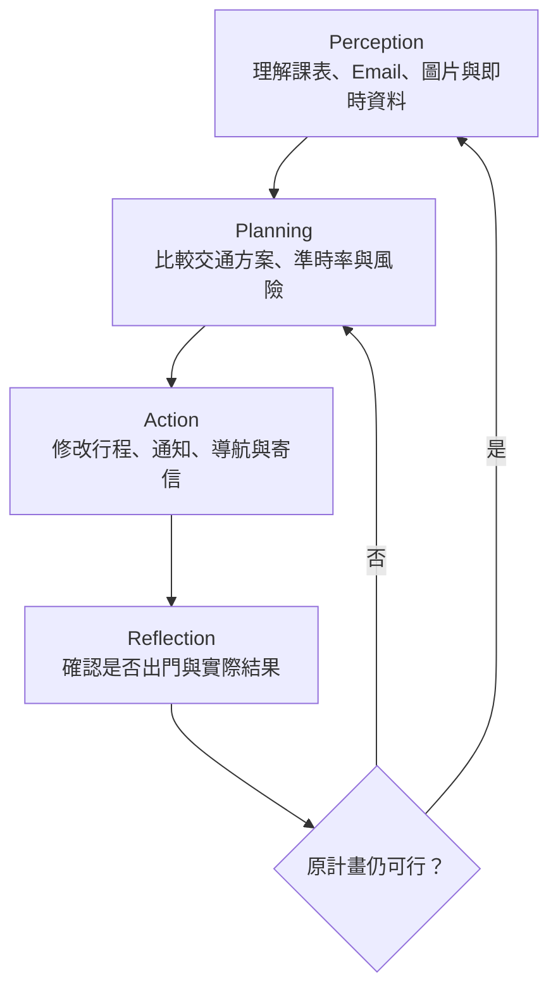

# CampusPulse｜大學生即時校園生存 Agent

## 一句話定位

> 讀懂學生的課表、信件與行程，持續監控天氣、交通、YouBike、積淹水與空氣品質，在狀況改變時主動重新安排出發時間、交通方式及後續行動。

CampusPulse 不是一般的地圖導航，而是一個知道以下資訊的「校園行程執行代理人」：

- 你幾點在哪間教室上課。
- 報告、考試或重要會議不能遲到。
- 今天適合騎機車、YouBike、搭公車或步行。
- 哪裡正在下大雨或發生積水。
- YouBike 是否可能被借光。
- 公車是否延誤。
- 你是否已經出門。

---

## 為什麼是台灣大學生的真實痛點？

台灣大學生的交通方式相當多元且破碎：

- 騎機車
- YouBike
- 公車
- 火車
- 步行
- 不同校區接駁
- 臨時請同學接送

通學過程也經常受到以下因素影響：

- 午後雷陣雨
- 颱風、豪雨及道路積水
- YouBike 無車或無位
- 公車延誤
- 臨時更換教室
- 教授臨時寄信更改上課方式
- 空氣品質不佳
- 地震或校園突發狀況

Google Maps 可以告訴學生如何前往目的地，卻不知道「今天第一堂課需要上台報告，絕對不能遲到」，也不會持續監控環境、主動修改行程或通知相關人員。

---

## Agent 實際運作方式

### 情境範例

王大帥上傳一張課表截圖，Agent 辨識出：

> 星期三 09:00，需要到成功校區資訊系館上課。

早上 07:50，Agent 自動執行：

1. 查詢目前位置至成大的距離。
2. 查詢氣象署即時雨量。
3. 查詢附近 YouBike 可借車數。
4. 查詢 TDX 公車到站時間。
5. 查詢水利署積淹水感測器。
6. 讀取 Gmail，確認是否有更換教室或停課通知。

原始規畫為：

> 08:35 騎乘 YouBike 出發，預計 08:52 抵達。

但到了 08:15，環境出現變化：

- 08:30 預計出現強降雨。
- 最近的 YouBike 站只剩 1 輛車。
- 前往學校的道路出現積水警戒。

Agent 不只是發出警告，而是重新執行任務：

> 已將交通方式改成 08:22 搭乘 5 號公車，請在 7 分鐘內出門。新的預計抵達時間為 08:48。

如果使用者仍未出門，Agent 進一步提醒：

> 若再延遲 4 分鐘將無法準時抵達，是否要我寄信通知助教？

經使用者確認後，Agent 自動產生並寄出通知信。

---

## Agent Loop

- **Perception**：理解課表、Email、圖片與即時資料。
- **Planning**：比較交通方案、抵達機率及風險。
- **Action**：修改行程、通知、導航或寄信。
- **Reflection**：確認執行結果，判斷是否需要重新規畫。

---

## 免費即時資料怎麼串？

| 使用需求 | 免費資料來源 | Function Calling |
| --- | --- | --- |
| 即時天氣、雨量 | [中央氣象署](https://opendata.cwa.gov.tw/) | `get_weather()` |
| 公車到站與車輛位置 | [TDX](https://tdx.transportdata.tw/) | `get_bus_eta()` |
| YouBike 即時車位 | TDX／縣市政府開放資料 | `get_bike_status()` |
| 道路事件與車流 | [TDX 即時路況](https://traffic.transportdata.tw/) | `get_road_events()` |
| 都市積淹水 | [水資源物聯網](https://iot.wra.gov.tw/APIUseDoc.jsp) | `get_flood_sensors()` |
| 河川水位 | [水利署水利資料開放平台](https://opendata.wra.gov.tw/) | `get_water_level()` |
| AQI、PM2.5 | [環境部環境資料開放平台](https://data.moenv.gov.tw/) | `get_air_quality()` |
| 課堂通知 | Gmail API | `read_course_email()` |
| 個人行程 | Google Calendar API | `update_schedule()` |
| 教授／助教通知 | Gmail API | `send_email()` |

以上政府資料皆可免費使用；TDX、中央氣象署與環境部主要需免費註冊並取得 API Key。

---

## Gemini 技術分工

### Gemini 3 Flash

負責需要低延遲、頻繁執行的工作：

- 課表截圖辨識
- 即時資料摘要
- 信件分類
- 交通異常判斷
- 快速產生通知文字

### Gemini 3 Pro

負責需要較複雜推理與規畫的工作：

- 比較多種交通方案
- 根據課程重要性調整策略
- 判斷是否應該提早出門
- 整合雨量、淹水、道路及交通資料
- 規畫下一步工具調用
- 根據執行結果重新規畫

### Gemma

部署在手機端，負責隱私敏感或需要離線運作的工作：

- 離線讀取課表
- 偵測使用者是否已經出門
- 網路不穩時保留基本提醒
- 地震後離線提供基本避難指引
- 保護個人課表與位置隱私

三種模型各自負責適合的工作，使系統能同時兼顧推理能力、即時性、離線使用及個人隱私，而不是為了符合競賽條件而堆疊模型。

---

## 最精彩的競賽 Demo

### 第一幕：理解學生

使用者拍攝紙本課表或上傳課表截圖，Gemini 自動辨識：

- 課程名稱
- 上課時間
- 教室
- 校區
- 課程重要程度

系統隨後將課程建立至 Google Calendar。

### 第二幕：主動規畫

系統根據課程時間、目前位置及即時交通資訊決定：

> 08:32 從宿舍出發，步行至 YouBike 站，預計 08:53 抵達教室。

### 第三幕：環境突然改變

Demo 後台模擬以下事件：

- YouBike 歸零
- 豪雨警報發布
- 原定路線發生積水

Agent 自動調用 API，發現原計畫已經失效。

### 第四幕：自主重新執行

Agent 主動：

- 將交通方式改成公車
- 更新建議出發時間
- 修改 Google Calendar
- 導航至新的公車站
- 必要時產生遲到通知信

這段流程能讓評審清楚看見 CampusPulse 具備感知、規畫、行動與反思能力，而不只是聊天機器人或即時資料儀表板。

---

## 可以增加的創新功能

### 1. 課程重要度推理

Agent 根據信件與課程資訊區分：

- 普通上課
- 期中考或期末考
- 分組報告
- 與教授會面
- 實驗課
- 可以線上參與的課程

面對期中考、報告或實驗課時，Agent 會自動增加交通緩衝時間，並優先選擇可靠度較高的交通方案。

### 2. 同學互助交通

如果大雨造成公車與 YouBike 都不可行，Agent 可以在取得本人同意後：

- 找出同堂課且順路的同學
- 發送共乘詢問
- 整理集合地點
- 更新雙方行程

PoC 階段可以使用模擬學生帳號，不必實際存取其他學生的位置資訊。

### 3. 地震後校園模式

地震發生後，Agent 切換至安全模式：

- 顯示最近的集合地點
- 讓學生一鍵回報安全
- 通知預先指定的聯絡人
- 使用相機檢查宿舍是否有明顯掉落物或出口阻塞
- 網路中斷時由 Gemma 提供離線指引

### 4. 減少無效等待

當公車延誤或活動取消時，Agent 可以：

- 重新安排讀書或用餐時間
- 尋找附近適合利用空檔的地點
- 延後出發時間
- 避免提早抵達後長時間等待

---

## 如何避免變成普通導航 App？

| 普通導航 | CampusPulse Agent |
| --- | --- |
| 使用者手動輸入目的地 | 自動從課表與信件理解目的地 |
| 只計算一次路線 | 持續監控環境並重新規畫 |
| 不知道行程重要性 | 理解考試、報告與一般課程的差異 |
| 只顯示交通資訊 | 主動修改行程、通知與寄信 |
| 依賴使用者重新操作 | 根據環境反饋自主執行 |
| 所有人得到相似路線 | 根據課程、交通習慣及風險個人化 |

---

## 競賽評分預估

| 評分項目 | 優勢 | 預估 |
| --- | --- | ---: |
| Innovation & Impact | 將課表語意與城市即時資料結合，不是單純導航 | 36／40 |
| Problem Definition & PoC | 台灣學生交通方式多元、天氣多變，問題明確 | 27／30 |
| Implementation & Usability | 課表上傳、行程卡片及主動通知容易展示 | 27／30 |
| **總分** |  | **90／100** |

---

## 建議先從成大版本開始

不需要一開始支援全台灣，可以先完成：

> **CampusPulse NCKU：成大學生的即時通學與校園行程 Agent**

第一版範圍：

- 成大各校區與主要建築
- 臺南公車
- 臺南 YouBike
- 即時雨量
- AQI
- 都市積淹水
- Google Calendar
- Gmail 課程通知

先將成大版本的使用流程與 Agent Loop 做完整，再證明相同架構能擴展至臺大、清大及陽明交大等校園。

---

## 作品名稱與標語

> **CampusPulse——會看課表、懂城市，也會把你送進教室的 AI Agent。**
